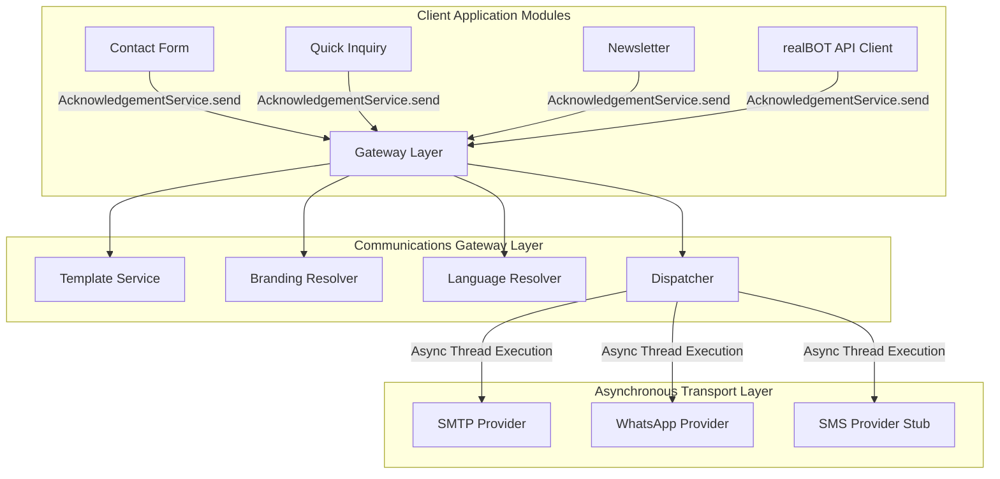

<!-- OLIVINE-PLATFORM-META -->
<!--
Issued By: Astra (Platform Owner-Propertism)
Reviewed By: Viji (Product Owner & Final Decision Authority)
Created By: Astra
Created On: 2026-07-04 18:36:00
Last Updated By: Astra
Last Updated On: 2026-07-04 18:36:00
Searchtag: SCCB-PROP-M2.X-COMM-001-03-ARCHITECTURE-UPDATE-REPORT
-->

# SCCB-PROP-M2.X-COMM-001-03
## Architecture Update Report

**Status:** COMPLETED  
**Version:** 1.0  
**Repository:** Propertism  
**Date:** July 04, 2026  

---

## 1. System Architecture Overview

The new design decouples forms and modules from raw SMTP or WhatsApp APIs, introducing a provider-dispatcher transport abstraction running asynchronous workers:

---

## 2. API Schema

Exposed paths routed via `communications.urls`:
*   `GET /api/v1/communications/templates/`
*   `GET /api/v1/communications/channels/`
*   `POST /api/v1/communications/send/`
*   `GET /api/v1/communications/history/`
*   `GET /api/v1/communications/deliveries/`
*   `GET /api/v1/communications/logs/`
*   `GET /api/v1/communications/retries/`
*   `GET /api/v1/communications/dashboard/`

---

***
*Maintained by Astra | 2026-07-04 18:36 IST*
