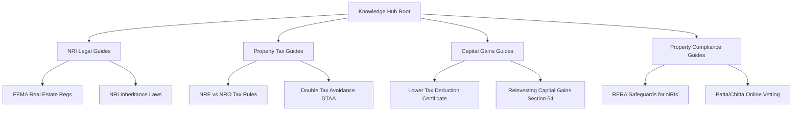

# Propertism Knowledge Hub Roadmap: Phase-B Content Expansion

This roadmap outlines the plan for expanding the Knowledge Hub authority from the foundational Phase-A articles to high-value, deep-dive topic clusters focusing on NRI property issues.

## Content Pillars & Hub-and-Spoke Model

We structure the content expansion into 4 core pillars. Each pillar starts with a primary "pillar page" guide, surrounded by highly specific "spoke" articles that interlink bi-directionally to maximize crawl equity and build topical authority.

---

## Pillar 1: NRI Legal & Documentation Guides
Focuses on property ownership, powers of attorney, inheritance, and transaction authorization from abroad.

### Proposed Articles:
1. **FEMA Regulations for NRI Property Transactions**
   * *Objective:* Demystify what is legally permissible under FEMA (Foreign Exchange Management Act) regarding buying, gifting, inheriting, and selling land/buildings in India.
   * *E-E-A-T Focus:* Citing Reserve Bank of India (RBI) notifications and FEMA sections.
   
2. **Executing a Power of Attorney (POA) for Real Estate from Abroad**
   * *Objective:* Step-by-step documentation workflow for executing, apostilling/consulating, and registered POAs in Chennai/India without travel.
   * *Internal Links:* Link to `/chennai/nri-power-of-attorney/` view.

3. **NRI Succession & Inheritance Law in India**
   * *Objective:* Clear paths for legal heirs abroad to claim ancestral property, mutate municipal records, and verify title integrity.

---

## Pillar 2: NRI Property Tax Guides
Covers rental income taxation, filing requirements, and international double taxation relief.

### Proposed Articles:
1. **Taxation of NRI Rental Income (NRO Account Operations)**
   * *Objective:* Detail the 31.2% TDS requirement on NRI rentals, Form 15CA/15CB filings, and NRO account routing.
   * *Internal Links:* Link to `/chennai/nri-rental-management/`.

2. **DTAA (Double Tax Avoidance Agreement) for Real Estate Income**
   * *Objective:* How US, UK, UAE, and Canadian resident NRIs can avoid double taxation on Indian property income.
   * *E-E-A-T Focus:* Interactive guide detailing treaty benefits and foreign tax credit (FTC) claims.

---

## Pillar 3: NRI Capital Gains & Exit Planning
Essential for NRI sellers wanting to repatriate funds cleanly.

### Proposed Articles:
1. **Lower Tax Deduction Certificate (LTDC) Guide for Property Sale**
   * *Objective:* Detailed guide on Section 197 applications to reduce TDS on property sale from 20%+ to actual capital gains liability (~3-5%).
   * *Internal Links:* Link to `/chennai/nri-sell-property/`.

2. **Reinvesting Property Sale Proceeds: Section 54, 54EC, & 54F**
   * *Objective:* How to legally exempt capital gains by purchasing another property in India or investing in Capital Gains Bonds (REC/PFC/NHAI).

3. **Repatriation of Funds under the $1 Million USD Scheme**
   * *Objective:* Form 15CA/15CB documentation checklists for foreign outward remittances via authorized AD-Category 1 bank channels.

---

## Pillar 4: Property Compliance & Civic Infrastructure
Navigating local municipal departments, land registries, and RERA protections.

### Proposed Articles:
1. **RERA Protections & Rights for NRI Buyers**
   * *Objective:* How the Real Estate Regulation Act protects NRI investors against builder delay, structural defects, and layout deviations.

2. **How to Vet Property Titles Online in Tamil Nadu (Patta/EC Search)**
   * *Objective:* Detailed procedural checklist for navigating the TN e-Services portal, verifying Chitta records, and analyzing Encumbrance Certificates.
   * *Internal Links:* Link to `property_owner_resources` view.

---

## Governance & Content Review Plan
* **Review Cycle:** All articles undergo a quarterly legal and financial compliance review to match tax code updates.
* **Schema Standards:** Mandatory Person (Author) and FAQPage JSON-LD schemas automatically compiled for each article.
