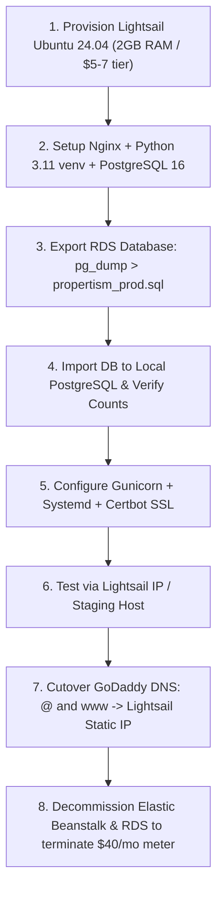

<!-- AUDIT METADATA -->
<!-- Date: 2026-08-26 -->
<!-- Time: 21:10 IST -->
<!-- Product Owner: Viji -->
<!-- Supervisor: Astra -->
<!-- Module: 03-propertism -->
<!-- Status: APPROVED ARCHITECTURAL BLUEPRINT -->
<!-- Target Execution Window: September 15 – 25, 2026 -->

# 🏛️ ARCHITECTURAL BLUEPRINT & MIGRATION PLAN
## Propertism Infrastructure Right-Sizing: Elastic Beanstalk + RDS ➔ Unified AWS Lightsail

---

## 1. 📌 Executive Summary & Incident Chronology

### 1.1 Outage Diagnostics (2026-08-26)
* **Symptom**: `www.propertism.in` returned `DNS_PROBE_FINISHED_NXDOMAIN` (Unreachable).
* **Root Cause**: The CloudFront distribution (`d1yv5od4i0bho.cloudfront.net`) returned 0 IP addresses because the AWS Account (`622370466597` under Amazon Web Services India Pvt Ltd / AISPL) entered a service subscription hiatus (`OptInRequired` / `NotSignedUp`). This was triggered by periodic RBI e-mandate card re-authorization requirements.
* **Restoration**: Root owner accessed `https://signup.aws.amazon.com/billing/signup?type=resubscribe#/urp`, accepted updated terms, and instantly restored `HTTP 200 OK` across all production endpoints with zero data loss.

---

## 2. 💰 Financial Audit & Credit Runway Analysis

### 2.1 Credit Balance & Historical Consumption (from Amazon Q & AWS Billing)
* **Total Promotional Credits Remaining**: **`$32.56`** (Nominal expiry: March 5, 2027).
* **Historical Credit Grant**: **`~$180.00`** ($100 Free Tier + $20 Bedrock + $20 EC2 + $20 RDS + $20 Budgets).
* **Current Monthly Burn Rate (Elastic Beanstalk + RDS Multi-Tier)**:
  * **Amazon EC2 (Elastic Beanstalk Compute)**: `$16.70 / mo`
  * **Amazon RDS (PostgreSQL `db.t3.micro`)**: `$15.69 / mo`
  * **Amazon VPC (Public IPv4 In-Use + NAT/EIPs)**: `$7.44 / mo`
  * **S3 Storage & CloudFront Data Transfer**: `~$0.25 / mo`
  * **Total Baseline Burn**: **`~$40.08 / month`** (~₹3,300 – ₹3,500 INR/mo + GST).

### 2.2 Why Credits Burned in 4.5 Months (The Free-Tier Trap)
* While standard EC2/RDS compute hours were nominally "Free Tier", AWS charged for peripheral infrastructure: mandatory public IPv4 fees ($0.005/hr = $3.65/mo per IP), EBS gp3 root storage, and multi-tier VPC routing.
* At `$40/mo`, `$180` in credits lasted only ~4.5 months. If originally deployed on a `$5/mo` VPS, the `$180` credits would have provided **36 months (3 full years)** of runway.

### 2.3 Interim Optimization Applied (2026-08-26)
* **Action**: Purchased a **1-Year Compute Savings Plan** for EC2 at `$0.008/hr` (`No Upfront`, `$0.00` paid today).
* **Savings Plan ID**: `3a6e5866-ec3b-4e62-8131-d6838a860471` (Status: `ACTIVE`).
* **Financial Impact**: EC2 compute dropped from `$16.70/mo` to **`$5.84/mo`** (65% discount).
* **Runway Extension**: Total burn dropped from `$1.33/day` to **`$0.96/day`**, stretching the remaining `$32.56` credits from mid-September to **~September 29 – October 1, 2026** at **`₹0.00 out-of-pocket`**.

---

## 3. 📈 Traffic Reality Check (Google Analytics 4 Telemetry)

Verified via live GA4 Property (`G-WZCH8BV34J` / `propertism.in`):
* **Total Visitors YTD (Jan – Aug 2026)**: **1,100 (1.1K)** unique active users.
* **Daily Volume**: **~50 to 150 visits / day**.
* **Realtime Concurrency**: **1 to 5 active users** simultaneously.
* **Key Business Events**: **175 verified lead inquiries & engagements**.

---

## 4. ⚖️ Architectural Decision Record (ADR)

### Context & Problem Statement
Is an enterprise multi-tier architecture (Elastic Beanstalk + Dedicated RDS PostgreSQL + Multi-Subnet VPC + CloudFront) justified at **`$40/mo` (~₹3,500/mo)** for a platform serving ~100 visits/day, or should Propertism right-size to a **Unified AWS Lightsail Box at `$5–$7/mo` (~₹500/mo)**?

### Evaluation Matrix

| Decision Factor | Current: Elastic Beanstalk + RDS | Option 2: Unified AWS Lightsail |
|---|---|---|
| **Monthly Cost** | **$40.08 / mo** (~₹3,300–₹3,500 INR) | **$5.00 – $7.00 / mo** (~₹420–₹580 INR) |
| **Annual Cost** | **~₹40,000 / year** | **~₹6,000 / year** |
| **Annual Savings** | Baseline | **~₹34,000 INR saved / year (85% reduction)** |
| **Traffic Capacity** | 100,000+ visits/day (Overkill) | **25,000+ visits/day (Huge Headroom)** |
| **Database Latency** | 2–5 ms (over network VPC) | **< 1 ms (Local Unix socket on NVMe SSD)** |
| **Deploy Speed** | 3 to 5 minutes (S3 container rebuild) | **15 to 20 seconds (Git + venv cache)** |
| **Billing Predictability**| Variable (IPv4, EBS IOPS, VPC data charges) | **100% Flat Predictable Rate** |

### Thorough Analysis of Cons & Risk Mitigations

1. **Single Point of Failure (SPOF)**:
   * *Risk*: Web server and database share one virtual instance.
   * *Mitigation*: Enable AWS Lightsail **Automated Daily Snapshots** (retained automatically). Systemd `Restart=always` policies guarantee immediate daemon resurrection upon crash.
2. **Manual DB Maintenance**:
   * *Risk*: No RDS point-in-time recovery to a specific minute.
   * *Mitigation*: Daily automated snapshots + a nightly `pg_dump` cron job backing up to a private S3 bucket.
3. **No Auto-Scaling**:
   * *Risk*: Cannot dynamically spin up 5 EC2 instances.
   * *Mitigation*: At ~100 visits/day, 2 GB RAM / 1 vCPU operates at `< 1%` CPU utilization. Upgrading to 4 GB or 8 GB is a 1-click resize in Lightsail if traffic surges 500×.

### Final Decision
**MIGRATE TO AWS LIGHTSAIL IN MID-SEPTEMBER 2026.**  
Run on existing free credits until ~September 15–20, then execute a 2-hour planned cutover before regular billing starts.

---

## 5. 🔄 CI/CD & Dependency Management on Lightsail

### How `requirements.txt` Works Going Forward
Unlike Elastic Beanstalk (which re-downloads and compiles all 50+ packages from scratch on every deploy), Lightsail maintains a persistent Python virtual environment:

```bash
# Automated GitHub Actions / Deploy Runner:
cd /var/www/propertism
git pull origin main
source venv/bin/activate
pip install -r requirements.txt --upgrade --quiet  # Installs ONLY newly added packages in 1s
python manage.py migrate --noinput                # Applies schema changes
python manage.py collectstatic --noinput          # Collects static assets
sudo systemctl reload gunicorn                    # Zero-downtime worker reload
```

---

## 6. 🛠️ Step-by-Step Migration Execution Plan



### Phase 1: Instance Provisioning (Duration: 10 mins)
1. In AWS Console → **AWS Lightsail**.
2. Create Instance: **Linux/Unix** → **OS Only: Ubuntu 24.04 LTS**.
3. Plan: **$5.00 / mo** (1 GB RAM, 1 vCPU, 40 GB SSD) or **$10.00 / mo** (2 GB RAM, 1 vCPU, 60 GB SSD).
4. Attach **Static IP**.

### Phase 2: Database Migration (Duration: 20 mins)
1. Dump live RDS PostgreSQL database:
   ```bash
   pg_dump -h <rds-endpoint> -U propertism_admin -d propertism_db -F c -b -v -f /tmp/propertism_prod.dump
   ```
2. Restore into Lightsail PostgreSQL 16:
   ```bash
   pg_restore -U propertism -d propertism /tmp/propertism_prod.dump
   ```
3. Run verification scripts (`audit_model_counts.py`) to guarantee 100% record parity.

### Phase 3: Application & Web Server Configuration (Duration: 25 mins)
1. Clone repo: `git clone https://github.com/Propertism/propertism.git /var/www/propertism`.
2. Configure `.env` with local DB connection string (`localhost:5432`).
3. Set up **Gunicorn socket/service** (`/etc/systemd/system/gunicorn.service`).
4. Set up **Nginx reverse proxy** with gzip compression, security headers, and static file caching.
5. Provision Let's Encrypt SSL via **Certbot** (`certbot --nginx -d propertism.in -d www.propertism.in`).

### Phase 4: DNS Cutover & Zero-Downtime Switch (Duration: 10 mins)
1. Update GoDaddy DNS:
   * `A` record `@` ➔ `Lightsail Static IP`
   * `A` record `www` ➔ `Lightsail Static IP`
2. TTL set to `300` (5 minutes) for rapid propagation.
3. Test live forms, realBOT inquiry intake, admin dashboard, and property image uploads.

### Phase 5: Resource Decommissioning & Cleanup (Duration: 15 mins)
1. Take final EBS snapshot of RDS instance for permanent archive.
2. Terminate Elastic Beanstalk environment (`propertism-prod-2026`).
3. Delete RDS database instance (`propertism-db`).
4. Release unused Elastic IPs.
5. Verify AWS Cost Explorer shows daily spend dropping to **$0.16 / day**.

---

## 7. 🗣️ Stakeholder Communication Template

**Approved Message from Viji to Propertism Owner:**

> *"Hi [Name],*  
> *Quick update on Propertism.in hosting:*  
>  
> *During our launch and initial setup phase, we ran on AWS's enterprise tier (Elastic Beanstalk & RDS) using promotional credits to test and stabilize the platform. Everything is working solidly, and our remaining credits cover us through mid-September.*  
>  
> *Now that the platform is stable and traffic patterns are established (~100 visits/day), the planned next step is right-sizing the infrastructure for long-term cost efficiency:*  
> • *Moving from the multi-tier launch setup to a dedicated **AWS Lightsail** production box.*  
> • *This brings our permanent monthly hosting cost down to just **~₹500 – ₹700 / month** ($6–$8/mo) all-inclusive, with daily automated backups and SSL included.*  
> • *It locks in our annual hosting overhead at under **₹7,000 to ₹8,000 / year**.*  
>  
> *Timeline: We will stay on the free tier until mid-September, and around September 15th, I’ll handle the transition to the ₹500/mo plan before the first regular invoice begins.*  
>  
> *Best,*  
> *Viji"*

---

*Authored & Persisted by Astra — Implementation Supervisor & Platform Owner*
