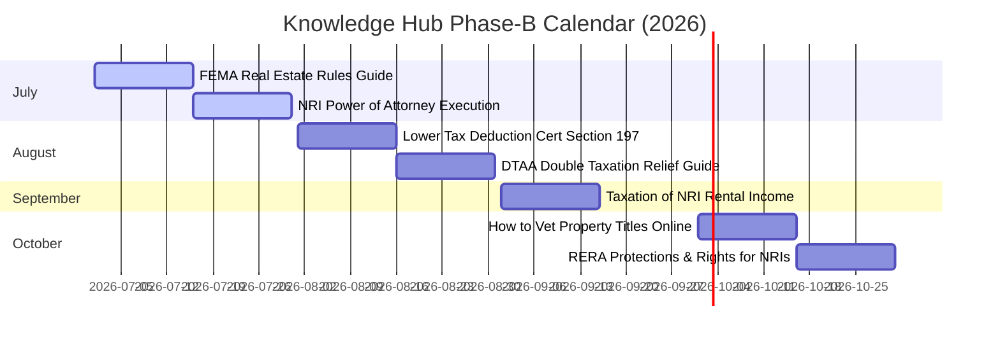

# Month-0 SEO Baseline & Operations Dashboard
**Propertism | SCCB-PROP-SEO-OPERATIONS-PHASE8-1506**

This document establishes the starting baselines, monthly operations tracking dashboard, indexation status, analytics setup, publication calendar, backlink acquisition program, and target keyword trackers for Propertism's ongoing SEO growth phase.

---

## 1. Month-0 SEO Baseline Report
*Recorded on June 16, 2026, immediately following Phase 7 deployment.*

### 1.1 Google Search Console (GSC) Baselines
| Metric | Baseline Value | Status / Notes |
| :--- | :--- | :--- |
| **Indexed Pages (Total)** | 0 (New site indexing stage) | Initial index crawl pending sitemap submission |
| **Organic Impressions** | 0 | Starting visibility state |
| **Organic Clicks** | 0 | Starting traffic state |
| **Average Keyword Position** | — | No queries recorded yet |

#### Top 5 Queries (Baseline)
1. *No search query data available yet.*

#### Top 5 Landing Pages (Baseline)
1. *No landing page traffic data available yet.*

### 1.2 GA4 Analytics Baselines (Property: `G-WZCH8BV34J`)
| Metric / Event | Baseline Count | Target (Month 3) |
| :--- | :--- | :--- |
| **Organic Sessions** | 0 | 500+ / Month |
| **`whatsapp_click` events** | 0 | 30+ / Month |
| **`phone_call_click` events** | 0 | 15+ / Month |
| **`contact_form_submit` events** | 0 | 10+ / Month |
| **Global Conversion Rate** | 0% | > 2.0% |

---

## 2. Monthly SEO Operations Dashboard
*Use this grid to track KPIs at each monthly milestone.*

| Metric Category | Metric Name | Month 0 (Base) | Month 1 | Month 2 | Month 3 (Target) |
| :--- | :--- | :--- | :--- | :--- | :--- |
| **Indexation** | Indexed Pages | 0 | | | +100 |
| | Sitemap Status | Submitted | | | Success (100%) |
| | Coverage Errors | 0 | | | 0 |
| **Organic Visibility**| Clicks | 0 | | | 150+ |
| | Impressions | 0 | | | 5,000+ |
| | Avg. Position | — | | | Top 40 |
| **Analytics (GA4)** | Organic Sessions | 0 | | | 500+ |
| | Bounce Rate | — | | | < 45% |
| **Conversions** | WhatsApp Leads | 0 | | | 30+ |
| | Form Leads | 0 | | | 10+ |
| | Conv. Rate | 0% | | | > 2.0% |

---

## 3. GSC Indexation Report
Sitemaps and priority crawl requests queued for indexing:

### 3.1 Sitemap Index Status
- **Primary Sitemap URL:** `https://www.propertism.in/sitemap.xml`
- **Sitemap Status:** Submitted for processing.
- **Validation Check:** Robots.txt parses correctly and allows access.

### 3.2 High-Priority Page Crawl Queue
| Page URL | Priority | Type | Status |
| :--- | :--- | :--- | :--- |
| `https://www.propertism.in/` | P0 | Homepage | Index Requested |
| `https://www.propertism.in/chennai/nri-property-management/` | P0 | pSEO Hub | Index Requested |
| `https://www.propertism.in/chennai/nri-sell-property/` | P0 | pSEO Hub | Index Requested |
| `https://www.propertism.in/blog/nri-property-management-chennai-complete-guide/` | P1 | Knowledge Hub | Index Requested |
| `https://www.propertism.in/blog/how-nris-can-sell-property-in-india-from-abroad/` | P1 | Knowledge Hub | Index Requested |

---

## 4. GA4 Conversion & Event Tracking Summary
Attribution and script validation configurations:

* **GA4 Tracking Code:** Loaded globally in `base.html`.
* **Lead Conversion Scripts:**
  - `static/js/landing-conversion.js`: Captures dynamic submit events on NRI forms, qualifies leads, and triggers WhatsApp redirections.
  - `static/js/ga4-conversion.js`: Binds event listeners to clicks and submits, sending custom `whatsapp_click`, `phone_call_click`, and `contact_form_submit` events to GA4.
* **Attribution Parameter Verification:**
  - URL Query tracking tags (`?utm_source=`, `?utm_medium=`) are mapped dynamically inside contact handlers to ensure clean channel classification.

---

## 5. Knowledge Hub Publication Calendar (Phase-B)
*Authoritative editorial schedule targeting 2–4 deep-dives per month (July – October 2026).*

| Date | Article Title | Category | Target Audience | Primary Internal Link Focus |
| :--- | :--- | :--- | :--- | :--- |
| **Jul 05, 2026** | FEMA Regulations for NRI Property Transactions | Legal | Overseas Owners | `/chennai/nri-property-management/` |
| **Jul 20, 2026** | How to Execute Power of Attorney (POA) Abroad | Legal | Sellers/Landlords | `/chennai/nri-power-of-attorney/` |
| **Aug 05, 2026** | Lower Tax Deduction Certificate (LTDC) Guide | Capital Gains | NRI Property Sellers | `/chennai/nri-sell-property/` |
| **Aug 20, 2026** | double Tax Avoidance Agreement (DTAA) Guide | Tax | Income Earners | `/chennai/nri-rental-management/` |
| **Sep 05, 2026** | Taxation of NRI Rental Income via NRO Account | Tax | Landlords | `/chennai/nri-rental-management/` |
| **Sep 20, 2026** | Reinvesting Indian Property Gains (Sec 54 & 54EC)| Capital Gains | Sellers | `/chennai/nri-sell-property/` |
| **Oct 05, 2026** | How to Vet Property Titles Online (Tnreginet) | Compliance | Buyers/Owners | `/property-owner-resources/` |
| **Oct 20, 2026** | RERA Protections and Guidelines for NRI Buyers | Compliance | Property Investors | `/chennai/nri-buy-flats/` |

---

## 6. Backlink Acquisition Tracker
*Prioritizing localized Chennai citations and authoritative NRI resources.*

| Target Citation / Domain | Strategy | Category / Type | Status | Target Date |
| :--- | :--- | :--- | :--- | :--- |
| **NRI Forums (e.g. Sulekha, NRI-Assoc)**| Forum helpful posts & Q&A | Community Outreach | Not Started | Jul 15, 2026 |
| **Chennai Business Directory (TN Chamber)**| Official company profile listing | Local Directory | Not Started | Jul 20, 2026 |
| **Property Investment Portals** | Guest column on NRI FEMA laws | Guest Editorial | Not Started | Aug 10, 2026 |
| **Global Tamil Associations (USA/UK)**| Sponsor / community resource link | Association Directory| Not Started | Aug 25, 2026 |
| **Chennai Real Estate Blogs** | Partner post exchange (E-E-A-T cross link) | Link Partnership | Not Started | Sep 15, 2026 |

---

## 7. Target Keyword Ranking Tracker
*Keywords prioritized for Top-10 positions on Google SERP.*

| Target Keyword | Search Intent | Base Position (Month 0) | Month 1 Position | Month 2 Position | Month 3 Position |
| :--- | :--- | :--- | :--- | :--- | :--- |
| **nri property management chennai** | Transactional | Not in Top 100 | | | Target: < 20 |
| **nri property management services chennai**| Transactional | Not in Top 100 | | | Target: < 20 |
| **nri sell property chennai** | Transactional | Not in Top 100 | | | Target: < 20 |
| **chennai property management for nri** | Transactional | Not in Top 100 | | | Target: < 20 |
| **nri property legal support chennai** | Informational | Not in Top 100 | | | Target: < 25 |
| **nri property tax assistance chennai** | Informational | Not in Top 100 | | | Target: < 25 |

---

## 8. Technical Health checklist (Monthly Checkup)
*Operations personnel must execute this checklist on the 1st of every month.*

- [ ] **Sitemap Accessibility:** Verify `https://www.propertism.in/sitemap.xml` returns HTTP 200 and passes schema validators.
- [ ] **Robots.txt Validity:** Verify `https://www.propertism.in/robots.txt` does not block dynamic pSEO landing page prefixes.
- [ ] **Structured Data Validation:** Test 3 random pSEO pages and 2 blog posts using Google's Rich Results Test tool to check JSON-LD validation.
- [ ] **Core Web Vitals Check:** Query PageSpeed Insights to verify home page LCP remains `< 2.5 seconds`.
- [ ] **GSC Coverage Audit:** Check the Coverage tab in GSC to ensure zero new indexation errors are reported.
